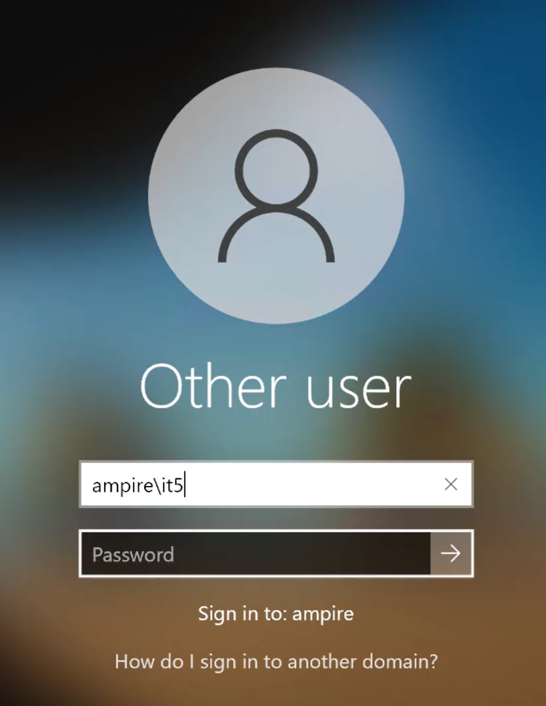

---
## Front matter
lang: ru-RU
title: Лабораторная работа № 1-D
subtitle: Защита корпоративного мессенджера
author:
  - Доберштейн А. С., Оразгелдиев Я. О., Барабанова К. А.
institute:
  - Российский университет дружбы народов, Москва, Россия

## i18n babel
babel-lang: russian
babel-otherlangs: english

## Formatting pdf
toc: false
toc-title: Содержание
slide_level: 2
aspectratio: 169
section-titles: true
theme: metropolis
header-includes:
 - \usetheme{metropolis}
 - \usepackage{fontspec}
 - \usepackage{polyglossia}
 - \setdefaultlanguage{russian}
 - \setmainfont{FreeSerif}
 - \setsansfont{FreeSerif}
 - \setmonofont{FreeSerif}
 - \usepackage{amsmath}
 - \usepackage{amssymb}
---

# Информация

## Докладчик

:::::::::::::: {.columns align=center}
::: {.column width="70%"}

  * Доберштейн А. С., Оразгелдиев Я. О., Барабанова К. А.
  * НФИбд-02-22
  * Российский университет дружбы народов

:::

::::::::::::::

## Цель работы

Основной целью работы является получение навыков обнаружения и устранение уязвимостей  WordPress-wpDiscuz, Proxylogon, Rocket.Chat и их последствий.

## Выполнение лабораторной работы

Для начала изучили вектор атаки, адреса злоумышленника и атакуемых серверов.

{#fig:001 width=70%}

## Уязвимость WordPress-wpDiscuz

Залогинились в ViPNet для обнаружения уязвимости в журнале событий.

{#fig:002 width=70%}

## Уязвимость WordPress-wpDiscuz

В "Событиях" обнаружили событие AM Exploit Wordpress с программным кодом, предназначенным для эксплуатации уязвимости

{#fig:003 width=70%}

## Уязвимость WordPress-wpDiscuz

Изучили информацию по CVE-коду об обнаруженной уязвимости, изучили рекомендации по нейтрализации. 

{#fig:004 width=70%}

## Уязвимость WordPress-wpDiscuz

Для устранения уязвимости подключились к удаленному рабочему столу по адресу 10.140.2.180

{#fig:005 width=70%}

## Уязвимость WordPress-wpDiscuz

Вошли под указанной учетной записью. 

{#fig:006 width=70%}

## Уязвимость WordPress-wpDiscuz

В соответствии с вектором атаки в KeePass нашли CMS WordPress. 

{#fig:007 width=70%}

## Уязвимость WordPress-wpDiscuz

Просмотрели сайт WordPress по указанному адресу. Здесь обнаружили последствие - Deface - изменение внешнего вида интерфейса. 

{#fig:008 width=70%}

## Уязвимость WordPress-wpDiscuz

В панели администрирования перешли во вкладку с плагинами и деактивировали плагин wpDiscuz 

{#fig:009 width=70%}

## Уязвимость WordPress-wpDiscuz

Для того, чтобы устранить последствие Deface, необходимо откатить сайт до предыдущей резервной копии. Для этого перешли в панель администрирования и во вкладке с плагинами нашли плагин UpdraftPlus - Backup/Restore, перешли в "Settings".

{#fig:010 width=70%}

## Уязвимость WordPress-wpDiscuz

Выбрали последнюю резервную копию и нажали "Restore". 

{#fig:011 width=70%}

## Уязвимость WordPress-wpDiscuz

Поставили флажки у компонентов "Themes" и "Uploads". 

{#fig:012 width=70%}

## Уязвимость WordPress-wpDiscuz

Во всплывшем окне с ошибкой нажали "Удалить старые директории"

{#fig:013 width=70%}

## Уязвимость WordPress-wpDiscuz

Когда директории удалились, нажали "Return to UpdraftPlus configuration"

{#fig:014 width=70%}

## Уязвимость WordPress-wpDiscuz

Обновили страницу сайта. Убедились, что последствие Deface успешно устранено.

{#fig:015 width=70%}

## Уязвимость WordPress-wpDiscuz

Перешли в Putty web-portal, чтобы проверить сокеты на наличие подозрительных процессов с помощью утилиты ss.

{#fig:016 width=70%}

## Уязвимость WordPress-wpDiscuz

Уничтожили вредоносные соединения с помощью команды kill {pid}. Убедились в их отсутствии.

{#fig:017 width=70%}

## Уязвимость WordPress-wpDiscuz

Первая уязвимость с ее последствием успешно устранены

{#fig:018 width=70%}

## Уязвимость Proxylogon

Вернулись в ViPNet для обнаружения подозрительной активности в журнале событий.

{#fig:019 width=70%}

## Уязвимость Proxylogon

Изучили информацию об обнаруженной уязвимости.

{#fig:020 width=70%}

## Уязвимость Proxylogon

В соответствии с вектором атаки в KeePass нашли MS Exchange.

{#fig:021 width=70%}

## Уязвимость Proxylogon

Подключились к удаленному рабочему столу по адресу в соответствии с вектором атаки. Открыли Internet Information Services Manager. 

{#fig:022 width=70%}

## Уязвимость Proxylogon

Перешли в /MAIL/Sites/Default Web Site/ecp

{#fig:023 width=70%}

## Уязвимость Proxylogon

Перешли в IP Address and Domain Restrictions, в "Actions" выбрали "Edit Feature Settings", в открывшемся окне в параметре "Access for unspecified clients" выбрали "Deny".

{#fig:024 width=70%}

## Уязвимость Proxylogon

Далее открыли терминал, чтобы обнаружить вредоносные процессы с помощью утилиты netstat.

{#fig:025 width=70%}

## Уязвимость Proxylogon

{#fig:026 width=70%}

## Уязвимость Proxylogon

Остановили эти процессы и проверили их отсутствие.

{#fig:027 width=70%}

## Уязвимость Proxylogon

Далее в директории /C:/Program Files/Microsoft/Exchange Server/V15/FrontEnd/HttpProxy/owa/auth удалили файл AM_Backdoor.aspx

{#fig:028 width=70%}

## Уязвимость Proxylogon

Уязвимость Proxylogon и ее последствие China Chopper успешно устранены.

{#fig:029 width=70%}

## Уязвимость Rocket.Chat

Вернулись в ViPNet для обнаружения подозрительной активности в журнале событий. 

{#fig:030 width=70%}

## Уязвимость Rocket.Chat

Изучили информацию об обнаруженной уязвимости.

{#fig:031 width=70%}

## Уязвимость Rocket.Chat

В соответствии с вектором атаки в KeePass нашли RocketChat.

{#fig:032 width=70%}

## Уязвимость Rocket.Chat

Открыли веб-версию Rocket.Chat и нажали на сброс пароля для указанной учетной записи.

{#fig:033 width=70%}

## Уязвимость Rocket.Chat

На почту администратора Rocket.Chat было направлено email-письмо с инструкциями по сбросу пароля.

{#fig:034 width=70%}

## Уязвимость Rocket.Chat

В консоли от администратор просмотрели это письмо. Скопировали ссылку со сгенерированным токеном для сброса пароля. 

{#fig:035 width=70%}

## Уязвимость Rocket.Chat

Перешли по скопированному адресу в браузере

{#fig:036 width=70%}

## Уязвимость Rocket.Chat

Задали новый пароль для пользователя

{#fig:037 width=70%}

## Уязвимость Rocket.Chat

Просмотрели /home/user/backup_codes для прохождения двухфакторной аутентификации при сбросе пароля. 

{#fig:038 width=70%}

## Уязвимость Rocket.Chat

Ввели один из них в соответствующее поле ввода.

{#fig:039 width=70%}

## Уязвимость Rocket.Chat

Залогинились с измененным паролем. 

{#fig:040 width=70%}

## Уязвимость Rocket.Chat

В панели администриования перешли в "Права доступа", и для роли "User" поставили флажок "User must use Two factor Authentication".

{#fig:041 width=70%}

## Уязвимость Rocket.Chat

Перешли во вкладку "Учетные записи" и настроили подтверждение адреса электронной почты при регистрации для роли "User" и автоматическую настройку двухфакторной аутентификации по электронной почте для новых пользователей.

{#fig:042 width=70%}

## Уязвимость Rocket.Chat

{#fig:043 width=70%}

## Уязвимость Rocket.Chat

В терминале администратора Rocket.Chat-server отредактировали файл mongod.conf, расскомментировав параметр "security:" и прописав отключение выполнения JavaScript на стороне сервера базы данных "javascriptEnabled: False".

{#fig:044 width=70%}

## Уязвимость Rocket.Chat

Перезапустили службу mongod.service

{#fig:045 width=70%}

## Уязвимость Rocket.Chat

С помощью утилиты ss обнаружили и остановили вредоносные процессы.

{#fig:046 width=70%}

## Уязвимость Rocket.Chat

Уязвимость RocketChat RCE и ее последствие meterpreter успешно устранены.

{#fig:047 width=70%}

## Завершение выполнения лабораторной работы

Заполнили карточки инцидентов для уязвимостей и их последствий.

{#fig:048 width=70%}

## Выводы

В результате выполнения лабораторной работы мы получили навыки обнаружения и устранение уязвимостей  WordPress-wpDiscuz, Proxylogon, Rocket.Chat и их последствий.
