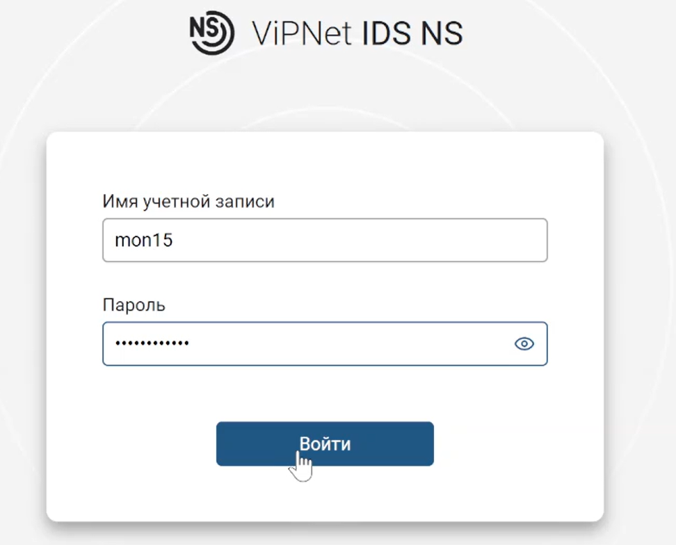

---
## Front matter
title: "Лабораторная работа № 1-D"
subtitle: "Защита корпоративного мессенджера"
author: "Доберштейн А. С., Оразгелдиев Я. О., Барабанова К. А."

## Generic otions
lang: ru-RU
toc-title: "Содержание"

## Bibliography
bibliography: bib/cite.bib

## Pdf output format
toc: true # Table of contents
toc-depth: 2
lof: true # List of figures
lot: false # List of tables
fontsize: 12pt
linestretch: 1.5
papersize: a4
documentclass: scrreprt
## I18n polyglossia
polyglossia-lang:
  name: russian
  options:
	- spelling=modern
	- babelshorthands=true
polyglossia-otherlangs:
  name: english
## I18n babel
babel-lang: russian
babel-otherlangs: english
## Fonts
mainfont: FreeSerif
romanfont: FreeSerif
sansfont: FreeSerif
monofont: FreeSerif
mainfontoptions: Ligatures=Common,Ligatures=TeX,Scale=0.94
romanfontoptions: Ligatures=Common,Ligatures=TeX,Scale=0.94
sansfontoptions: Ligatures=Common,Ligatures=TeX,Scale=MatchLowercase,Scale=0.94
monofontoptions: Scale=MatchLowercase,Scale=0.94,FakeStretch=0.9
mathfontoptions:
## Biblatex
biblatex: true
biblio-style: "gost-numeric"
biblatexoptions:
  - parentracker=true
  - backend=biber
  - hyperref=auto
  - language=auto
  - autolang=other*
  - citestyle=gost-numeric
## Pandoc-crossref LaTeX customization
figureTitle: "Рис."
tableTitle: "Таблица"
listingTitle: "Листинг"
lofTitle: "Список иллюстраций"
lotTitle: "Список таблиц"
lolTitle: "Листинги"
## Misc options
indent: true
header-includes:
  - \usepackage{indentfirst}
  - \usepackage{float} # keep figures where there are in the text
  - \floatplacement{figure}{H} # keep figures where there are in the text
---

# Цель работы

Основной целью работы является получение навыков обнаружения и устранение уязвимостей  WordPress-wpDiscuz, Proxylogon, Rocket.Chat и их последствий.

# Выполнение лабораторной работы

## Подготовка к выполнению лабораторной работы

Для начала изучили вектор атаки, адреса злоумышленника и атакуемых серверов.(рис. [-@fig:001]).

{#fig:001 width=70%}

## Уязвимость WordPress-wpDiscuz

Залогинились в ViPNet для обнаружения уязвимости в журнале событий.(рис. [-@fig:002]).

{#fig:002 width=70%}

В "Событиях" обнаружили событие AM Exploit Wordpress с программным кодом, предназначенным для эксплуатации уязвимости(рис. [-@fig:003]).

{#fig:003 width=70%}

Изучили информацию по CVE-коду об обнаруженной уязвимости, изучили рекомендации по нейтрализации. (рис. [-@fig:004]).

{#fig:004 width=70%}

Для устранения уязвимости подключились к удаленному рабочему столу по адресу 10.140.2.180(рис. [-@fig:005]).

{#fig:005 width=70%}

Вошли под указанной учетной записью. (рис. [-@fig:006]).

{#fig:006 width=70%}

В соответствии с вектором атаки в KeePass нашли CMS WordPress.(рис. [-@fig:007]). 

{#fig:007 width=70%}

Просмотрели сайт WordPress по указанному адресу. Здесь обнаружили последствие - Deface - изменение внешнего вида интерфейса. (рис. [-@fig:008]).

{#fig:008 width=70%}

В панели администрирования перешли во вкладку с плагинами и деактивировали плагин wpDiscuz (рис. [-@fig:009]).

{#fig:009 width=70%}

Для того, чтобы устранить последствие Deface, необходимо откатить сайт до предыдущей резервной копии. Для этого перешли в панель администрирования и во вкладке с плагинами нашли плагин UpdraftPlus - Backup/Restore, перешли в "Settings".(рис. [-@fig:010]).

{#fig:010 width=70%}

Выбрали последнюю резервную копию и нажали "Restore". (рис. [-@fig:011]).

{#fig:011 width=70%}

Поставили флажки у компонентов "Themes" и "Uploads". (рис. [-@fig:012]).

{#fig:012 width=70%}

Во всплывшем окне с ошибкой нажали "Удалить старые директории"(рис. [-@fig:013]).

{#fig:013 width=70%}

Когда директории удалились, нажали "Return to UpdraftPlus configuration"(рис. [-@fig:014]).

{#fig:014 width=70%}

Обновили страницу сайта. Убедились, что последствие Deface успешно устранено. (рис. [-@fig:015]).

{#fig:015 width=70%}

Перешли в Putty web-portal, чтобы проверить сокеты на наличие подозрительных процессов с помощью утилиты ss. (рис. [-@fig:016]).

{#fig:016 width=70%}

Уничтожили вредоносные соединения с помощью команды kill {pid}. Убедились в их отсутствии. (рис. [-@fig:017]).

{#fig:017 width=70%}

Первая уязвимость с ее последствием успешно устранены (рис. [-@fig:018]).

{#fig:018 width=70%}

## Уязвимость Proxylogon

Вернулись в ViPNet для обнаружения подозрительной активности в журнале событий. (рис. [-@fig:019]).

{#fig:019 width=70%}

Изучили информацию об обнаруженной уязвимости.(рис. [-@fig:020]).

{#fig:020 width=70%}

В соответствии с вектором атаки в KeePass нашли MS Exchange.(рис. [-@fig:021]). 

{#fig:021 width=70%}

Подключились к удаленному рабочему столу по адресу в соответствии с вектором атаки. Открыли Internet Information Services Manager. (рис. [-@fig:022]). 

{#fig:022 width=70%}

Перешли в /MAIL/Sites/Default Web Site/ecp(рис. [-@fig:023]). 

{#fig:023 width=70%}

Перешли в IP Address and Domain Restrictions, в "Actions" выбрали "Edit Feature Settings", в открывшемся окне в параметре "Access for unspecified clients" выбрали "Deny".(рис. [-@fig:024]). 

{#fig:024 width=70%}

Далее открыли терминал, чтобы обнаружить вредоносные процессы с помощью утилиты netstat. (рис. [-@fig:025]-[-@fig:026]). 

{#fig:025 width=70%}

{#fig:026 width=70%}

Остановили эти процессы и проверили их отсутствие.(рис. [-@fig:027]). 

{#fig:027 width=70%}

Далее в директории /C:/Program Files/Microsoft/Exchange Server/V15/FrontEnd/HttpProxy/owa/auth удалили файл AM_Backdoor.aspx(рис. [-@fig:028]). 

{#fig:028 width=70%}

Уязвимость Proxylogon и ее последствие China Chopper успешно устранены.(рис. [-@fig:029]). 

{#fig:029 width=70%}

## Уязвимость Rocket.Chat

Вернулись в ViPNet для обнаружения подозрительной активности в журнале событий. (рис. [-@fig:030]).

{#fig:030 width=70%}

Изучили информацию об обнаруженной уязвимости.(рис. [-@fig:031]).

{#fig:031 width=70%}

В соответствии с вектором атаки в KeePass нашли RocketChat.(рис. [-@fig:032]). 

{#fig:032 width=70%}

Открыли веб-версию Rocket.Chat и нажали на сброс пароля для указанной учетной записи.(рис. [-@fig:033]). 

{#fig:033 width=70%}

На почту администратора Rocket.Chat было направлено email-письмо с инструкциями по сбросу пароля.(рис. [-@fig:034]). 

{#fig:034 width=70%}

В консоли от администратор просмотрели это письмо. Скопировали ссылку со сгенерированным токеном для сброса пароля. (рис. [-@fig:035]). 

{#fig:035 width=70%}

Перешли по скопированному адресу в браузере(рис. [-@fig:036]). 

{#fig:036 width=70%}

Задали новый пароль для пользователя(рис. [-@fig:037]). 

{#fig:037 width=70%}

Просмотрели /home/user/backup_codes для прохождения двухфакторной аутентификации при сбросе пароля. (рис. [-@fig:038]). 

{#fig:038 width=70%}

Ввели один из них в соответствующее поле ввода.(рис. [-@fig:039]). 

{#fig:039 width=70%}

Залогинились с измененным паролем. (рис. [-@fig:040]). 

{#fig:040 width=70%}

В панели администриования перешли в "Права доступа", и для роли "User" поставили флажок "User must use Two factor Authentication".(рис. [-@fig:041]). 

{#fig:041 width=70%}

Перешли во вкладку "Учетные записи" и настроили подтверждение адреса электронной почты при регистрации для роли "User" и автоматическую настройку двухфакторной аутентификации по электронной почте для новых пользователей.(рис. [-@fig:042]-[-@fig:043]). 

{#fig:042 width=70%}

{#fig:043 width=70%}

В терминале администратора Rocket.Chat-server отредактировали файл mongod.conf, расскомментировав параметр "security:" и прописав отключение выполнения JavaScript на стороне сервера базы данных "javascriptEnabled: False".(рис. [-@fig:044]). 

{#fig:044 width=70%}

Перезапустили службу mongod.service(рис. [-@fig:045]). 

{#fig:045 width=70%}

С помощью утилиты ss обнаружили и остановили вредоносные процессы.(рис. [-@fig:046]). 

{#fig:046 width=70%}

Уязвимость RocketChat RCE и ее последствие meterpreter успешно устранены.(рис. [-@fig:047]). 

{#fig:047 width=70%}

## Завершение выполнения лабораторной работы

Заполнили карточки инцидентов для уязвимостей и их последствий.(рис. [-@fig:048]). 

{#fig:048 width=70%}

# Выводы

В результате выполнения лабораторной работы мы получили навыки обнаружения и устранение уязвимостей  WordPress-wpDiscuz, Proxylogon, Rocket.Chat и их последствий.

# Список литературы{.unnumbered}

::: {#refs}
:::
