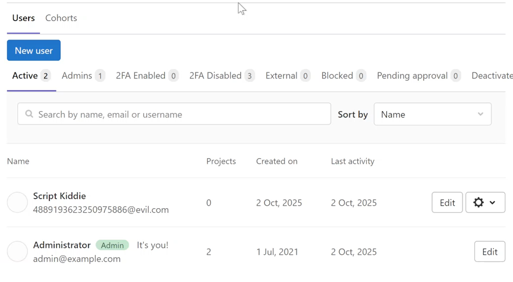

---
## Front matter
lang: ru-RU
title: Лабораторная работа № 2-D
subtitle: Защита интеграционной платформы
author:
  - Доберштейн А., Оразгелдиев Я., Лобанова П., Лушин А., Барабанова К.
institute:
  - Российский университет дружбы народов, Москва, Россия

## i18n babel
babel-lang: russian
babel-otherlangs: english

## Formatting pdf
toc: false
toc-title: Содержание
slide_level: 2
aspectratio: 169
section-titles: true
theme: metropolis
header-includes:
 - \usetheme{metropolis}
 - \usepackage{fontspec}
 - \usepackage{polyglossia}
 - \setdefaultlanguage{russian}
 - \setmainfont{FreeSerif}
 - \setsansfont{FreeSerif}
 - \setmonofont{FreeSerif}
 - \usepackage{amsmath}
 - \usepackage{amssymb}
---

# Информация

## Докладчик

:::::::::::::: {.columns align=center}
::: {.column width="70%"}

  * Доберштейн А., Оразгелдиев Я., Лобанова П., Лушин А., Барабанова К.
  * НФИбд-02-22
  * Российский университет дружбы народов

:::

::::::::::::::

## Цель работы

Основной целью работы является получение навыков обнаружения и устранение уязвимостей Bitrix vote RCE, GitLab RCE, WSO2 API-Manager RCE и их последствий.

## Выполнение лабораторной работы

Для начала изучили вектор атаки, адреса злоумышленника и атакуемых серверов.

{#fig:001 width=70%}

## Уязвимость Bitrix vote RCE

Залогинились в ViPNet для обнаружения уязвимости в журнале событий.

{#fig:002 width=70%}

## Уязвимость Bitrix vote RCE

В "Событиях" обнаружили события: внедрение полезной нагрузки в HTTP-запрос, PHP-скрипт с кодом для удаленного выполнения команд, информирование о скачивании исполняемого файла с машины нарушителя. 

{#fig:003 width=70%}

## Уязвимость Bitrix vote RCE

Изучили информацию по CVE-коду об обнаруженной уязвимости, изучили рекомендации по нейтрализации. 

{#fig:004 width=70%}

## Уязвимость Bitrix vote RCE

Для устранения уязвимости подключились к удаленному рабочему столу. 

{#fig:005 width=70%}

## Уязвимость Bitrix vote RCE

Вошли под указанной учетной записью. 

{#fig:006 width=70%}

## Уязвимость Bitrix vote RCE

В соответствии с вектором атаки в KeePass нашли CMS Bitrix. 

{#fig:007 width=70%}

## Уязвимость Bitrix vote RCE

В лог-файле apache2 по пути /var/log/apache2/access.log обнаружили следующую информацию: два запроса к файлу /bitrix/tools/vote/uf.php с внедрением полезной нагрузки для последующей загрузки веб-backdoor и запрос к файлу веб-backdoor для создания WebShell сессии с машиной нарушителя.

{#fig:008 width=70%}

## Уязвимость Bitrix vote RCE

Произвели поиск по названию полезной нагрузки с помощью команды find /var/www/html/ -iname «payload2.phar», нашли данный файл.

{#fig:009 width=70%}

## Уязвимость Bitrix vote RCE

Просмотрели содержимое с помощью текстового редактора, отобразилась информация о скачивании веб-backdoor по пути /var/www/html/caidao.php.

{#fig:010 width=70%}

## Уязвимость Bitrix vote RCE

Открыли сайт Bitrix. Не удалось получить доступ к интерфейсу администрирования из-за действующей полузной нагрузки. 

{#fig:011 width=70%}

## Уязвимость Bitrix vote RCE

Для устранения вектора для локального повышения привелегий (LPE) удалили SUID-бит у файла /var/www/html/apache_restart с
помощью команды chmod –s /var/www/html/apache_restart. 

{#fig:012 width=70%}

## Уязвимость Bitrix vote RCE

Для закрытия уязвимости добавиkb изменения в файл /var/www/html/bitrix/tools/vote/uf.php, перед require_once и между знаков вопроса вставили код:

{#fig:013 width=70%}

## Уязвимость Bitrix vote RCE

Создали файл .htaccess в директории /var/www/html/bitrix/tools/vote, задающий правила работы веб-сервера для конкретного каталога и подкаталогов. Для закрытия уязвимости в данном файле можно прописали команду deny from all.

{#fig:014 width=70%}

## Уязвимость Bitrix vote RCE

С помощью утилиты ss и команды kill закрыли meterpreter сессии.

{#fig:015 width=70%}

## Уязвимость Bitrix vote RCE

В директории веб-сервера обнаружили скрипт password_recovery.php.

{#fig:016 width=70%}

## Уязвимость Bitrix vote RCE

Прописали новый пароль.

{#fig:017 width=70%}

## Уязвимость Bitrix vote RCE

Подключились к веб-серверу, в ссылке указали название данного файла. 

{#fig:018 width=70%}

## Уязвимость Bitrix vote RCE

Авторизовались с правами администратора 

{#fig:019 width=70%}

## Уязвимость Bitrix vote RCE

Открылась панель администрирования. 

{#fig:020 width=70%}

## Уязвимость Bitrix vote RCE

Удалили файл password_recovery.php. 

{#fig:021 width=70%}

## Уязвимость Bitrix vote RCE

Доступ к панели администрирования восстановлен. Удалили все файлы в директории взломанного веб-сервера. 

{#fig:022 width=70%}

## Уязвимость Bitrix vote RCE

Файл резервной копии разархивировали в директорию /var/www/html с помощью команды tar xvzf /var/bitrix_backups/Bitrix_full_backup.tar.gz -C /var/www/html. 

{#fig:023 width=70%}

## Уязвимость Bitrix vote RCE

Далее повторили действия по устранению полезной нагрузки: 
Для устранения вектора для локального повышения привелегий (LPE) удалили SUID-бит у файла /var/www/html/apache_restart с
помощью команды chmod –s /var/www/html/apache_restart. 

{#fig:024 width=70%}

## Уязвимость Bitrix vote RCE

Для закрытия уязвимости добавиkb изменения в файл /var/www/html/bitrix/tools/vote/uf.php, перед require_once и между знаков вопроса вставили код:

{#fig:025 width=70%}

## Уязвимость Bitrix vote RCE

Создали файл .htaccess в директории /var/www/html/bitrix/tools/vote, задающий правила работы веб-сервера для конкретного каталога и подкаталогов. Для закрытия уязвимости в данном файле можно прописали команду deny from all

{#fig:026 width=70%}

## Уязвимость Bitrix vote RCE

Удалили файл /var/www/html/apache_restart.

{#fig:027 width=70%}

## Уязвимость Bitrix vote RCE

Уязвимость с ее последствием успешно устранены 

{#fig:028 width=70%}

## Уязвимость GitLab RCE

Вернулись в ViPNet для обнаружения подозрительной активности в журнале событий. Изучили информацию об обнаруженной уязвимости.

{#fig:029 width=70%}

## Уязвимость GitLab RCE

В соответствии с вектором атаки в KeePass нашли GitLab. 

{#fig:030 width=70%}

## Уязвимость GitLab RCE

Подключились к удаленному рабочему столу по адресу в соответствии с вектором атаки. Открыли веб-интерфейс GitLab и авторизовались под учетной записью администратора.  

{#fig:031 width=70%}

## Уязвимость GitLab RCE

Перешли на страницу Admin Area.  

{#fig:032 width=70%}

## Уязвимость GitLab RCE

В левой панели инструментов перешли во вкладку Settings – General. 

{#fig:033 width=70%}

## Уязвимость GitLab RCE

в настройках нашли пункт Sign-up restrictions и нажали кнопку Expand.  

{#fig:034 width=70%}

## Уязвимость GitLab RCE

Настроили конфигурацию, разрешающую регистрацию новых аккаунтов только с одобрения адмнистратора. 

{#fig:035 width=70%}

## Уязвимость GitLab RCE

Сохранили конфигурацию.  

{#fig:036 width=70%}

## Уязвимость GitLab RCE

В панели администратора перешли во вкладку Users 

{#fig:037 width=70%}

## Уязвимость GitLab RCE

В строке с пользователем Script Kiddie нажали Delete user and contributions.  

{#fig:038 width=70%}

## Уязвимость GitLab RCE

Подтвердили удаление.  

{#fig:039 width=70%}

## Уязвимость GitLab RCE

С помощью утилиты ss и команды kill закрыли meterpreter сессии. 

{#fig:040 width=70%}

## Уязвимость GitLab RCE

Уязвимость с ее последствием успешно устранены 

{#fig:041 width=70%}

## Уязвимость WSO2 API-Manager RCE

Вернулись в ViPNet для обнаружения подозрительной активности в журнале событий. 

{#fig:042 width=70%}

## Уязвимость WSO2 API-Manager RCE

Изучили информацию об обнаруженной уязвимости.

{#fig:043 width=70%}

## Уязвимость WSO2 API-Manager RCE

В соответствии с вектором атаки в KeePass нашли API-Manager. 

{#fig:044 width=70%}

## Уязвимость WSO2 API-Manager RCE

Открыли файл конфигурации WSO2 API-Manager и добавили в конец запись resource.access_control.

{#fig:045 width=70%}

## Уязвимость WSO2 API-Manager RCE

{#fig:046 width=70%}

## Уязвимость WSO2 API-Manager RCE

Удалили загруженный exploit.jsp файл по пути /opt/wso2am-4.0.0/repository/deployment/server/webapps/authentic
ationendpoint. 

{#fig:047 width=70%}

## Уязвимость WSO2 API-Manager RCE

Удалили сгенерированный файл /tmpp/payload.elf. 

{#fig:048 width=70%}

## Уязвимость WSO2 API-Manager RCE

С помощью утилиты ss и команды kill закрыли meterpreter сессии.

{#fig:049 width=70%}

## Уязвимость WSO2 API-Manager RCE

Зашли в веб-интерфейс WSO2 API-Manager по ссылке https://10.10.2.27:9443/carbon и авторизовались под учетной записью администратора. 

{#fig:050 width=70%}

## Уязвимость WSO2 API-Manager RCE

Просмотрели список пользователей. 

{#fig:051 width=70%}

## Уязвимость WSO2 API-Manager RCE

Удалили пользователя hacker.

{#fig:052 width=70%}

## Уязвимость WSO2 API-Manager RCE

Уязвимость с ее последствием успешно устранены. 

{#fig:053 width=70%}

## Выводы

В результате выполнения лабораторной работы мы получили навыки обнаружения и устранение уязвимостей Bitrix vote RCE, GitLab RCE, WSO2 API-Manager RCE и их последствий.
